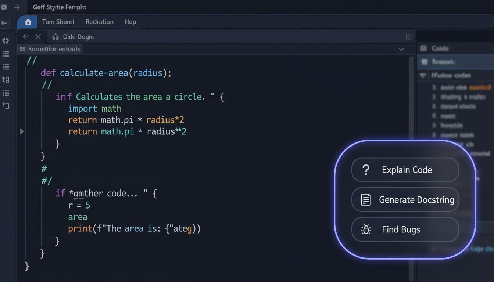
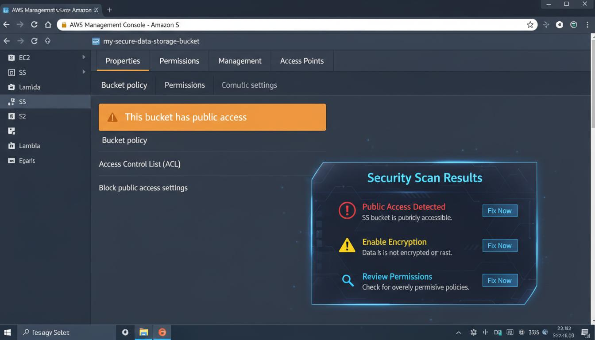
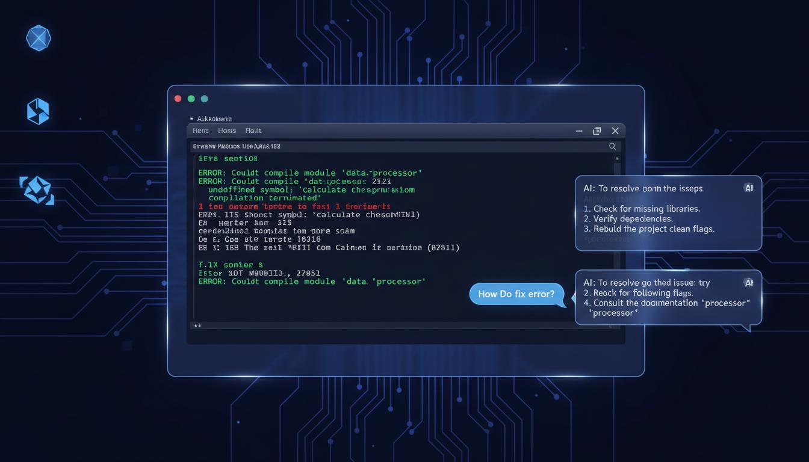
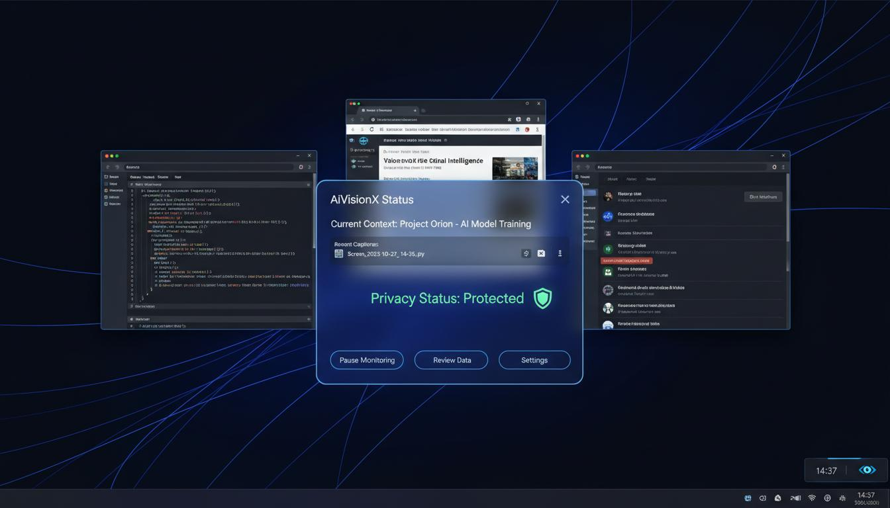

# AiVisionX Demo Walkthrough
## Interactive Overlay Demonstration

---

## Overview

This document showcases the AiVisionX overlay interface in action across different use cases.

### Demo Scenarios

1. **Code Analysis** - Developer workflow with VS Code
2. **Security Scan** - AWS console security analysis
3. **Error Resolution** - Terminal error troubleshooting
4. **Status Dashboard** - System monitoring panel

---

## Demo 1: Code Analysis Overlay



### Scenario
A developer is working on a Python function in VS Code and activates AiVisionX.

### Overlay Features Shown:

| Feature | Description | Shortcut |
|---------|-------------|----------|
| **Explain Code** | AI analyzes and explains the current function | Ctrl+Shift+E |
| **Generate Docstring** | Auto-generates documentation | Ctrl+Shift+D |
| **Find Bugs** | Scans for potential issues | Ctrl+Shift+B |

### User Flow:
1. Developer selects code or places cursor in function
2. Presses `Ctrl+Space` to activate AiVisionX
3. Overlay appears with context-aware suggestions
4. Developer clicks "Explain Code"
5. AI provides detailed explanation in chat panel

---

## Demo 2: Security Scan Overlay



### Scenario
A security analyst is reviewing AWS S3 bucket permissions.

### Security Alerts Shown:

| Alert Level | Issue | Action |
|-------------|-------|--------|
| **Critical** | Public Access Detected | Fix Now |
| **Warning** | Encryption Not Enabled | Fix Now |
| **Info** | Permissions Review Needed | Review |

### User Flow:
1. Analyst opens AWS S3 console
2. AiVisionX automatically scans the configuration
3. Security overlay appears with detected issues
4. Each issue has a "Fix Now" button
5. Clicking provides step-by-step remediation

---

## Demo 3: Chat-Based Error Resolution



### Scenario
A developer encounters a compilation error in the terminal.

### Chat Features:

- **Natural language queries**: "How do I fix this error?"
- **Context-aware responses**: AI sees the terminal content
- **Step-by-step solutions**: Numbered instructions
- **Follow-up questions**: Continue the conversation

### User Flow:
1. Error appears in terminal
2. Developer presses `Ctrl+Space`
3. Types: "How do I fix this error?"
4. AI analyzes terminal output
5. Provides specific solution steps

---

## Demo 4: Status Dashboard



### Dashboard Elements:

| Element | Information Displayed |
|---------|----------------------|
| **Current Context** | Active project/task |
| **Recent Captures** | Last 5 screen captures |
| **Privacy Status** | Protected / Scanning / Paused |
| **Quick Actions** | Pause, Review Data, Settings |

### System Tray Integration:

- Click tray icon to open status panel
- Right-click for quick actions
- Visual indicator when AI is processing

---

## Overlay Interaction Patterns

### Keyboard Shortcuts

| Shortcut | Action |
|----------|--------|
| `Ctrl+Space` | Toggle overlay |
| `Esc` | Close overlay |
| `↑/↓` | Navigate suggestions |
| `Enter` | Select suggestion |
| `Tab` | Focus chat input |

### Mouse Interactions

- **Click-through**: Clicks pass through to underlying app
- **Drag**: Move overlay to different position
- **Resize**: Adjust panel size (corner handles)
- **Dismiss**: Click outside to close

---

## Visual Design System

### Colors

| Element | Color | Usage |
|---------|-------|-------|
| Background | `#0B0E1E` | Panel background |
| Border | `rgba(244,246,255,0.08)` | Subtle borders |
| Accent | `#4F46E5` | Buttons, highlights |
| Text Primary | `#F4F6FF` | Headings, important text |
| Text Secondary | `#A7ACBF` | Descriptions |

### Typography

- **Headings**: Space Grotesk, 600-700 weight
- **Body**: Inter, 400-500 weight
- **Labels**: IBM Plex Mono, uppercase, tracking wide

### Effects

- **Backdrop blur**: 20px
- **Border radius**: 28px (large), 18px (small)
- **Shadow**: `0 28px 90px rgba(0,0,0,0.55)`

---

## Animation Specifications

### Entrance Animation

```css
@keyframes overlay-entrance {
  from {
    opacity: 0;
    transform: translateY(20px) scale(0.95);
  }
  to {
    opacity: 1;
    transform: translateY(0) scale(1);
  }
}
/* Duration: 300ms, Easing: cubic-bezier(0.16, 1, 0.3, 1) */
```

### Suggestion Hover

```css
.suggestion:hover {
  background: rgba(79, 70, 229, 0.1);
  transform: translateX(4px);
  transition: all 200ms ease;
}
```

### Pulse Indicator

```css
@keyframes processing-pulse {
  0%, 100% { opacity: 1; }
  50% { opacity: 0.5; }
}
/* Duration: 1.5s, Iteration: infinite */
```

---

## Responsive Behavior

### Desktop (>1024px)
- Full overlay with all features
- Multiple suggestion columns
- Expanded chat history

### Tablet (768-1024px)
- Condensed overlay
- Single suggestion column
- Collapsed chat (expandable)

### Mobile (<768px)
- Bottom sheet style
- Swipe to dismiss
- Simplified suggestions

---

## Accessibility

### Keyboard Navigation
- Full keyboard operability
- Visible focus indicators
- Logical tab order

### Screen Readers
- ARIA labels on all interactive elements
- Live regions for updates
- Descriptive alt text

### Visual
- Minimum contrast ratio: 4.5:1
- Focus indicators: 3px outline
- Reduced motion support

---

## Demo Video Script

### Scene 1: Introduction (0:00-0:15)
- Show desktop with VS Code open
- Narrator: "Meet AiVisionX, your AI-powered desktop assistant"
- Press Ctrl+Space, overlay appears

### Scene 2: Code Analysis (0:15-0:45)
- Select a function
- Click "Explain Code"
- Show AI explanation appearing in chat
- Highlight key insights

### Scene 3: Security Scan (0:45-1:15)
- Switch to AWS console
- Overlay automatically detects issues
- Show security alerts
- Click "Fix Now" and show solution

### Scene 4: Error Help (1:15-1:45)
- Show terminal with error
- Type "How do I fix this?"
- AI provides step-by-step solution
- Implement fix, error resolved

### Scene 5: Status Check (1:45-2:00)
- Click system tray icon
- Show status dashboard
- Highlight privacy protection
- End with CTA

---

**Demo Assets Location:** `/demo/`  
**Video Production:** Pending  
**Last Updated:** March 2026
